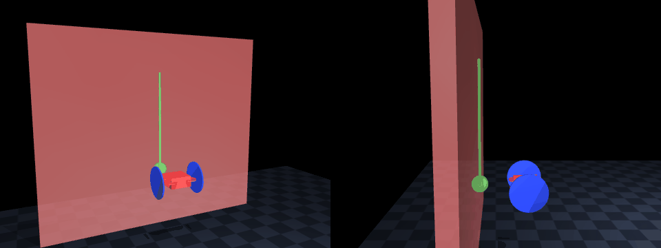

# mujoco-wheeled-uav-simulator

日本語のドキュメントは [README.ja.md](README.ja.md) をご覧ください。

`mujoco-wheeled-uav-simulator` is a [MuJoCo](https://mujoco.org/)-based simulator for a wheel-equipped quadrotor, with a Python simulator and MATLAB controllers communicating over UDP. It is intended both as a reusable simulation base for future research and as a reference implementation for reproducing control methods described in papers.



*The bundled `wall_demo`: an unmodified hover controller whose target position is simply placed behind the wall face, so the wall's reaction supplies the pressing force while the wheels roll along the wall. **Left** (3/4 view): the green vertical line is the commanded climb path and the green sphere is the reference position moving along it. **Right** (side view): the gap closes as the wheels reach the wall and they stay in contact for the whole climb — contact points and contact-force arrows are drawn at the wheel–wall interface. Recorded with `simulate --preset wall_demo --record wall_demo.gif`; resolution, camera views, and contact visualization come from `environment.recording` in the params (see Parameter management below).*

**Aerodynamic effect models** (config-gated wall-effect force injection): [docs/AERODYNAMICS.md](docs/AERODYNAMICS.md) — Japanese in [docs/AERODYNAMICS.ja.md](docs/AERODYNAMICS.ja.md).

Fidelity-mode usage and publication-oriented logging notes are summarized in [docs/FIDELITY_MODES.md](docs/FIDELITY_MODES.md).

**Time synchronization** (simulator time vs wall clock, UDP sample cadence, controller rules): [docs/TIMING.md](docs/TIMING.md) — Japanese summary in [docs/TIMING.ja.md](docs/TIMING.ja.md).

**Sample controllers and run scenarios** (`realtime` / `accelerated` / `lockstep`, HIL, CI): [docs/CONTROLLERS.md](docs/CONTROLLERS.md) — Japanese in [docs/CONTROLLERS.ja.md](docs/CONTROLLERS.ja.md).

**PX4 HITL (real Pixhawk in the loop)** — MuJoCo as the plant, the real PX4 EKF2/control stack unchanged: `uv sync --extra hil`, then see `uv run python -m wheeled_uav.px4_hitl --help`.

**Minimal wall-riding demo** (unmodified hover control with its target placed behind the wall face; wheels rolling on the wall): `wall_demo_controller` (MATLAB) with the `wall_demo` preset — see the demo section below.

## Run scenarios (summary)

| Goal | Simulator `pacing_mode` | Sample controller |
| --- | --- | --- |
| Interactive use, remote HIL | `realtime` (default) | `hover-controller` or external project MATLAB |
| Minimal wall-riding demo | `realtime` | `wall_demo_controller` (MATLAB) with the `wall_demo` preset |
| CI, batch sweeps, fast experiments | `accelerated` | Same (never waits on wall clock; uses `state.time`) |
| Deterministic co-simulation, exact replays | `lockstep` | Same (physics blocks until each control command arrives) |

- Simulator entry: `simulate` (`simulation.pacing_mode` in JSON or `--pacing-mode` CLI override)
- Python reference controller: `hover-controller` (single-UAV hover; logical sync only)
- Full launch examples and diagnostics: [docs/CONTROLLERS.md](docs/CONTROLLERS.md)

## Highlights

- MuJoCo simulation with a wheel-equipped quadrotor model
- MATLAB hover, minimal wall-riding demo, and formation-control workflows
- Shared parameter source in `vehicle_params.json` for Python and MATLAB
- Support for single-UAV, multi-instance, and single-world multi-UAV runs
- Contact logging and post-run analysis with `.mat` outputs
- Plane, slope, and function-based curved terrain support

## Requirements

- Python 3.12 or newer
- `uv`
- A local environment capable of showing the MuJoCo GUI
- MATLAB

## Quick Start

Install dependencies:

```powershell
uv sync
```

Run the default single-UAV simulation (`wuav` is a short alias for the same CLI):

```powershell
uv run mujoco-wheeled-uav-simulator simulate
```

```powershell
uv run wuav simulate
```

For remote-controller experiments, you can split the simulator bind and state-destination IPs:

```powershell
uv run mujoco-wheeled-uav-simulator simulate --bind-ip 0.0.0.0 --state-target-ip 192.168.0.42
```

To record an offscreen video of a run (the extension picks the format, e.g. `.mp4` or `.gif`; resolution and frame rate come from `environment.recording.{width,height,fps}` in the params):

```powershell
uv run wuav simulate --record logs/run.mp4
```

```matlab
hovering_controller
```

## Common Workflows

### Single-UAV Hover

```powershell
uv run mujoco-wheeled-uav-simulator simulate
```

```matlab
hovering_controller
```

You can also run the hover controller from Python instead of MATLAB:

```powershell
uv run mujoco-wheeled-uav-simulator hover-controller
uv run mujoco-wheeled-uav-simulator hover-controller --bind-ip 0.0.0.0 --target-ip 192.168.0.10
```

### Minimal Wall-Riding Demo

Ride the wall with no wall controller at all: the demo runs the UNMODIFIED
shared hover controller and simply places its target position behind the wall
face. The wall stops the vehicle, the position error provides the press, and
the height component of the same target follows a scripted climb/hold/descend
profile while the wheels roll on the wall. This is a deliberately trivial
baseline (no wall-specific control law, no pressing-force design, no traction
reasoning, no guarantee of contact) meant to show that the simulator supports
wheel-on-wall scenarios end to end — spawn, contact reporting, and logging
included.

```powershell
uv run wuav simulate --preset wall_demo
```

```matlab
wall_demo_controller
```

### Remote / Distributed Controller

The simulator and the controller can run on different machines. Clone the same repository on both so that `vehicle_params.json` and the packet behavior stay aligned:

```powershell
# machine running MuJoCo
uv run mujoco-wheeled-uav-simulator simulate --bind-ip 0.0.0.0 --state-target-ip 192.168.0.42
```

```bash
# machine running the controller
uv run mujoco-wheeled-uav-simulator hover-controller --bind-ip 0.0.0.0 --target-ip 192.168.0.10
```

Replace `192.168.0.42` with the controller-host IP and `192.168.0.10` with the simulator-host IP.

Single-UAV controller packet contract used by both MATLAB and Python hover controllers. Scenario mapping: [docs/CONTROLLERS.md](docs/CONTROLLERS.md).

- Simulator state packets are JSON objects containing at least `time`, `position`, `velocity`, `angular_velocity_body`, and `rotation_matrix`.
- `position`, `velocity`, and `angular_velocity_body` are 3-element vectors.
- `rotation_matrix` is a flattened 3x3 rotation matrix in row-major order.
- Controller command packets are JSON objects containing `rotor_thrusts`, `rotor_omega` (4-element vectors), or `wrench` (`[f_z, M_x, M_y, M_z]` body wrench, distributed through the pseudo-inverse of the geometry-derived allocation matrix).
- `hover-controller` is for single-UAV packets only; if it receives a multi-UAV packet with `uavs`, it stops with an error.
- Controller-side allocation (Python and MATLAB) is derived from the per-rotor geometry in `actuation.rotors` (position, thrust axis, spin sign), so arbitrary rotor ordering and fixed-tilt rotors are handled consistently with the generated MuJoCo actuators.

Baseline and HIL modes:

- `--fidelity-mode baseline` keeps the idealized reference path: no injected network delay, no injected packet loss, and no additional sensor or actuator degradation.
- `--fidelity-mode hil` enables the runtime to honor `network_fidelity` settings from `vehicle_params.json`, including state transmit delay, command receive delay, jitter, packet loss, and stale-command handling.
- Python and MATLAB logs now preserve packet metadata such as `sequence`, `source_state_sequence`, `wall_time_send_ns`, `state_age_ms`, and controller compute time so that remote runs can be evaluated with the same dataset structure.

Example HIL-oriented run:

```powershell
uv run mujoco-wheeled-uav-simulator simulate --fidelity-mode hil --bind-ip 0.0.0.0 --state-target-ip 192.168.0.42
uv run mujoco-wheeled-uav-simulator hover-controller --fidelity-mode hil --bind-ip 0.0.0.0 --target-ip 192.168.0.10
```

### Multi-UAV Formation in One MuJoCo World

```powershell
uv run mujoco-wheeled-uav-simulator simulate --num-uavs 3
```

```matlab
multi_uav_formation_controller('num_uavs', 3)
multi_uav_formation_controller('num_uavs', 3, 'formation_radius', 2.0, 'spawn_radius', 2.0, 'base_height', 1.8)
```

### Multiple Independent Simulator Instances

This mode is mainly useful for isolated single-UAV experiments and comparisons.

```powershell
uv run mujoco-wheeled-uav-simulator simulate --instance-id 0
uv run mujoco-wheeled-uav-simulator simulate --instance-id 1
uv run mujoco-wheeled-uav-simulator simulate --instance-id 0 --bind-ip 0.0.0.0 --state-target-ip 192.168.0.42
```

```matlab
hovering_controller('instance_id', 0)
hovering_controller('instance_id', 1)
```

### Model Validation Only

```powershell
uv run mujoco-wheeled-uav-simulator check-model
uv run mujoco-wheeled-uav-simulator check-model --instance-id 1
uv run mujoco-wheeled-uav-simulator check-model --num-uavs 3
```

## Citation

If you use this simulator in your research, please reference this repository by its URL. Formal citation metadata is also available in [CITATION.cff](CITATION.cff) (GitHub's "Cite this repository" button uses it). The underlying physics engine is [MuJoCo](https://mujoco.org/); refer to its documentation for how to cite MuJoCo itself.

## License

This project is released under the [MIT License](LICENSE).

## Using This Simulator From Your Own Repository

This repository is intended as a reusable simulator base plus a few samples. To build your own project on top of it, add it as a Git submodule, keep your controllers and configs in your repository, and pass your own parameter file with `simulate --params-file <your_params.json>`. Relative mesh paths in a parameter file resolve next to that file, so your repository can ship its own vehicle mesh and calibrated parameters without modifying the simulator.

## Advanced Reference

<details>
<summary>Repository layout</summary>

### Top-level files

| File | Role |
|------|------|
| `wheeled_uav/` | Main Python simulator package (see the package overview below). |
| `hovering_controller.m` | MATLAB entry point for hover control (`matlab/controllers/hovering_controller_impl.m`). |
| `wall_demo_controller.m` | MATLAB entry point for the minimal wall-riding demo (`matlab/controllers/wall_demo_controller_impl.m`). |
| `multi_uav_formation_controller.m` | MATLAB entry point for formation control in a single MuJoCo world containing multiple UAVs (`matlab/controllers/multi_uav_formation_controller_impl.m`). |
| `matlab/+uavsim/` | Shared MATLAB library package (session, UDP protocol, params, control math, joystick; see MATLAB overview). |
| `matlab/shared/simulation_logger.m` | MATLAB-side logger class that writes `.mat` logs under `logs/`. |
| `vehicle_params.json` | Shared vehicle, actuator, and environment parameters used by both Python and MATLAB. |
| `configs/` | Ready-made parameter presets (`vehicle_params.wall_demo.json` for the wall-riding demo scene). |
| `wheeled_uav.template.xml` | MuJoCo model template. At runtime, `vehicle_params.json` is used to render XML into `build/generated_xml/`. |
| `pyproject.toml` | Python dependency and packaging metadata (CLI names `mujoco-wheeled-uav-simulator` and `wuav`). |
| `uv.lock` | Lockfile for `uv`. |

### Python package overview

| Module | Role |
|------|------|
| `wheeled_uav/cli.py` | CLI entry point. Dispatches `simulate`, `check-model`, and `hover-controller`. |
| `wheeled_uav/config.py` | Loads `vehicle_params.json` and parses fidelity/aerodynamics configs. |
| `wheeled_uav/paths.py` | Centralizes important repository paths and shared constants. |
| `wheeled_uav/protocol.py` | UDP wire format shared by the simulator and all controllers (ports, sockets, packet parse/build). MuJoCo-free. |
| `wheeled_uav/timing.py` | Pacing modes, real-time tracking, and the controller-side timing helpers. |
| `wheeled_uav/types.py` | Shared Python dataclasses. |
| `wheeled_uav/model/` | MuJoCo model generation: `builder.py` (XML replacements), `surface.py` (terrain math + hfield emission), `poses.py` (spawn poses), `xml_format.py`. |
| `wheeled_uav/runtime/` | Simulation runtime: `scene.py` (request/scene/validate), `loop.py` (stepping/lockstep loops), `state_publisher.py`, `command_dispatcher.py`, `fidelity.py` (sensor noise + actuator dynamics), `contact.py`, `aerodynamics.py`, `visuals.py` (camera, overlay, recording). |
| `wheeled_uav/controllers/` | Reference controllers (`hover.py`); importable without MuJoCo for controller-only hosts. |

### MATLAB overview

The root-level `.m` files are deliberately thin: each one only sets up the MATLAB path and delegates to the matching `matlab/controllers/*_impl.m` implementation, so you can call `hovering_controller` from the repository root without managing paths yourself. The implementations hold all the logic.

| Path | Role |
|------|------|
| `matlab/+uavsim/Session.m` | Controller session bootstrap: params, UDP socket with port diagnostics, optional simulator auto-launch. |
| `matlab/+uavsim/Protocol.m` | UDP wire format: state packet decoding/metrics, duplicate-sample tracking, command packet build/send. |
| `matlab/+uavsim/Params.m` | `vehicle_params.json` parsing and the geometry-derived allocation matrix / mixer. |
| `matlab/+uavsim/Control.m` | Geometric control building blocks (hover PD, SO(3) attitude moments, wrench-to-thrust mixing). |
| `matlab/+uavsim/Joystick.m` | Joystick device access (`sim3d.io.Joystick` / `vrjoystick`) with deadzone and axis mapping. |
| `matlab/+uavsim/Launch.m` | Simulator launch command builders and UDP port checks. |
| `matlab/+uavsim/RunOptions.m`, `Metrics.m`, `LogFiles.m`, `Util.m` | Option parsing, runtime metrics, log discovery, small shared helpers. |
| `matlab/controllers/` | Sample controller implementations (hover, wall demo, formation), one `..._impl.m` per root entry point. |
| `matlab/shared/simulation_logger.m` | Logger class for saving state, control input, and contact summaries to `.mat` files. |

</details>

<details>
<summary>Ports, runtime modes, and communication</summary>

In single-instance mode, the Python simulator sends state to `127.0.0.1:5001`, and MATLAB sends per-rotor thrust or rotor-speed commands back to `127.0.0.1:5000`.

In multi-instance mode, ports are offset by `instance_id = i` as follows:

- simulator receive port: `5000 + 2*i`
- simulator state send port: `5001 + 2*i`

For example, with `instance_id = 1`, Python receives control commands on `5002` and sends state on `5003`. MATLAB must use the same `instance_id`, for example `hovering_controller('instance_id', 1)`.

If a MATLAB controller reports that its local UDP port is already in use, the usual cause is another MATLAB session or controller process still holding the same port. The shared controller runtime stops early with a diagnostic that includes the expected port and, on Windows, the owning process when it can be resolved. When running repeated tests, either fully close the earlier controller session or switch to another `instance_id`.

`multi_uav_formation_controller` is separate from the independent multi-instance flow and is the recommended path for formation experiments. With `simulate --num-uavs N`, one MuJoCo world contains `N` UAVs, and both state packets and control packets are exchanged as arrays.

</details>

<details>
<summary>Parameter management</summary>

Key vehicle and actuator parameters are centralized in `vehicle_params.json`. At the moment, this includes at least:

- gravity and simulation timestep
- optional solver settings: `simulation.integrator` (`Euler`, `RK4`, `implicit`, `implicitfast`), `simulation.cone` (`pyramidal`, `elliptic`), `simulation.iterations`, `simulation.noslip_iterations`
- optional state publishing decimation: `simulation.state_publish_every_n_steps` (default 1 = every step; the bundled config uses 5 = 200 Hz)
- viewer refresh rate: `simulation.viewer_fps` (default 60; the viewer no longer syncs at the physics rate)
- startup freeze: `simulation.hold_until_first_command` (default config: `true`) freezes the vehicles at their spawn pose until the first control command arrives, giving automatic/scripted runs (hover, formation, batch studies) a clean, reproducible initial condition. Presets that start physically resting on the ground set it to `false` in their JSON instead. Override per run with `simulate --hold-until-first-command` / `--no-hold-until-first-command`. Irrelevant in `lockstep` pacing, where physics only advances on received commands anyway.
- arm lengths, or an explicit per-rotor geometry list under `actuation.rotors` (position, thrust axis, spin sign, yaw moment ratio)
- yaw moment coefficient
- maximum rotor thrust
- thrust conversion coefficient `thrust_coefficient`
- initial vehicle position
- spawn pose policy under `drone.initial_spawn`: `mode` selects `"surface"` (default; wheels settled on the terrain), `"wall_contact"` (floor-plus-wall start with `wall_clearance_m` standoff, default 5 mm, and optional `b2_body`/`b3_body` initial attitude), or `"explicit"` (`positions_xy` places multi-UAV runs at chosen coordinates instead of the `--spawn-radius` ring; `center_x` overrides the wall-normal offset)
- main body and wheel dimensions and masses; `drone.inertial_reference` can be `"body_only"` (default; `drone.mass`/`drone.inertia` describe the central body, wheels add on top) or `"total_vehicle"` (`drone.mass`/`drone.inertia` describe the whole vehicle and the analytic wheel contributions are subtracted when the MuJoCo body is built)
- contact settings for floor, wall, body, and wheels (`solref`, plus optional `solimp` and `condim`). Note the key spelling differs per element: nested for wheels (`drone.wheels.solimp`/`condim`) and surface (`environment.surface.solimp`/`condim`), flat-prefixed for the wall (`environment.wall_solimp`, `environment.wall_condim`)
- contact friction: `drone.wheels.friction` and `environment.wall_friction` are 3-element MuJoCo `friction` vectors (sliding, torsional, rolling). The sliding value of `drone.wheels.friction` is the μ that governs how much cross-track force the wheels can sustain while rolling on the wall
- plane or function-based curved surface settings under `environment.surface`
- offscreen recording under `environment.recording` (`width`, `height`, `fps`; used by `simulate --record PATH`). Optional `views` renders several camera angles side by side in one clip (a list of `{azimuth, elevation, distance_scale}` overrides on the shared auto-framed view), and `show_contacts: true` additionally draws contact points and contact-force arrows in the recording (the interactive viewer keeps its own toggles)
- fidelity settings under `fidelity_mode`, `network_fidelity`, `actuator_dynamics`, `sensor_fidelity`, and `logging_config` (`logging_config.include_contact_details` toggles per-contact detail records in state packets; summaries are always sent)
- aerodynamic effect models under `aerodynamics` ([docs/AERODYNAMICS.md](docs/AERODYNAMICS.md))

For a publication-oriented workflow, treat `baseline` and `hil` as different experiment modes rather than small option tweaks. The detailed semantics, recommended metrics, and current implementation boundary are documented in [docs/FIDELITY_MODES.md](docs/FIDELITY_MODES.md).
- MuJoCo sensor names and their target body

On the Python side, MuJoCo XML is generated from `vehicle_params.json` and `wheeled_uav.template.xml`. By default the output goes to `build/generated_xml/`: `wheeled_uav.generated.xml` for `instance_id = 0`, and `wheeled_uav.generated.instance_N.xml` for nonzero instance IDs.

On the MATLAB side, the same `vehicle_params.json` is used to load mass, gravity, arm lengths, yaw moment coefficient, maximum thrust, thrust conversion coefficient, and default hover/contact control gains.

Controller defaults are centralized under `controller` in `vehicle_params.json`. At present, at least the following values are read from there:

- `desired_heading`
- `position_gain`, `velocity_gain`
- `attitude_gain`, `angular_velocity_gain`
- `position_error_limit_m`, `max_tilt_deg` — large-displacement safety clamps shared by the MATLAB and Python hover-law implementations (defaults 1.5 m / 35°, `<= 0` disables). The position-error norm fed to the PD is saturated, and the desired thrust vector keeps a minimum vertical component and at most this tilt from vertical, so a vehicle dragged far away in the viewer recovers with a bounded, upright maneuver instead of flipping or losing thrust.

Default formation-control settings are centralized under `formation` in `vehicle_params.json`. At present, at least the following values are read from there:

- `num_uavs`
- `spawn_radius`
- `base_height`
- `centroid_target_xy`
- `formation_radius`
- `centroid_gain`
- `formation_gain`
- `duration_seconds`
- `idle_sleep_seconds`
- `status_display_interval`
- gain/clamp overrides (`desired_heading`, `position_gain`, ..., `position_error_limit_m`, `max_tilt_deg`) — default to the `controller` section values

Formation runs keep only the combined `formation_bundle*.mat` file by default. If you want to keep both the bundle and the per-UAV files, run `multi_uav_formation_controller('formation_log_mode', 'bundle_and_individual')`. Inside the bundle, logs are available both as an ordered cell array under `formation_log.logs` and as named fields such as `formation_log.uavs.uav_1`, `formation_log.uavs.uav_2`, and so on.

</details>

<details>
<summary>Curved surface environments</summary>

`vehicle_params.json` supports either a plane or a curved surface of the form `z = h(x, y)` via `environment.surface`.

For routine switching, the simplest approach is to change `environment.surface.mode`.

- `"mode": "plane"` or `"mode": "floor"` for a flat floor
- `"mode": "slope"` for a sloped plane
- `"mode": "paraboloid"`, `"mode": "sinusoidal"`, or `"mode": "gaussian"` for other built-in surfaces

For example, switching between a flat floor and a slope only needs this single field:

```json
"surface": {
	"mode": "plane",
	...
}
```

or

```json
"surface": {
	"mode": "slope",
	...
}
```

`mode` is just a convenience toggle. The detailed shape is still controlled by the existing `type`, `plane`, `height_function`, and `parameters` settings.

By default, `follow_surface_for_initial_position = true`, so `initial_position.z` is interpreted as a height relative to the local surface. This prevents the vehicle from spawning inside the terrain when switching to curved or raised surfaces. If needed, set it to `false` to treat the value as an absolute world coordinate instead.

During ground-contact initialization, the roll angle is chosen to satisfy left and right wheel contact conditions, and an initial pitch angle is added from the terrain gradient `dh/dx`. The initial wheel-to-ground clearance can be adjusted via `environment.surface.initial_wheel_contact_clearance`. The current default is `0.0001` m.

`type = "plane"`:

- uses MuJoCo's plane geom as before
- keeps the contact behavior of the default flat floor

`type = "height_function"`:

- the Python side generates terrain from the `height_function` settings
- surfaces that can still be expressed as planes, such as `flat` and `slope`, are automatically converted into MuJoCo plane geoms
- nonplanar shapes such as `paraboloid` and `sinusoidal` are embedded as MuJoCo hfields
- supported function names are currently `flat`, `slope`, `paraboloid`, `sinusoidal`, and `gaussian`

Representative example:

```json
"surface": {
	"type": "height_function",
	"material": "floor_mat",
	"solref": [0.002, 1.0],
	"contact": {
		"contype": 1,
		"conaffinity": 1
	},
	"height_function": {
		"x_range": [-3.0, 3.0],
		"y_range": [-3.0, 3.0],
		"grid_resolution": [121, 121],
		"name": "slope",
		"parameters": {
			"z_offset": 0.0,
			"slope_x": 0.08,
			"slope_y": 0.0
		}
	}
}
```

For now, the project uses named functions with explicit parameters rather than evaluating raw expression strings. This is intentional for safety and maintainability.

`gaussian` is used to create hill- or bowl-shaped surfaces. Its main parameters are:

- `amplitude`: hill height; use a negative value for a depression
- `center_x`, `center_y`: center position
- `sigma_x`, `sigma_y`: spread of the hill

</details>

<details>
<summary>Fixed tilt rotors and input modes</summary>

If you want to represent fixed tilt rotors at the model level, use `actuation.rotors` in `vehicle_params.json`. Each rotor specifies its position and thrust axis in the body frame. The thrust axis is normalized automatically during loading, so the input does not need to be unit length.

```json
"actuation": {
	"command_mode": "omega",
	"max_rotor_thrust": 20.0,
	"yaw_moment_ratio": 0.02,
	"thrust_coefficient": 2.0e-5,
	"rotors": [
		{
			"name": "fr",
			"position_body": [0.08, -0.1, 0.012],
			"thrust_axis_body": [-0.14834, 0.197905, 0.968912],
			"yaw_moment_ratio": 0.02,
			"spin_sign": 1
		}
	]
}
```

`spin_sign` specifies the reaction-torque direction. Use `1` and `-1`.

The default `vehicle_params.json` uses conventional upward rotor axes (`[0, 0, 1]`) for all four rotors.

A fixed-tilt rotor example is provided in [vehicle_params.tilted_rotor_example.json](vehicle_params.tilted_rotor_example.json). It defines a symmetric 4-rotor layout tilted outward by about 14.3 degrees. To try it, run `uv run mujoco-wheeled-uav-simulator check-model` against it to inspect the generated model. The controller-side allocation matrix is derived from the same per-rotor geometry, so tilted layouts are mixed consistently with the generated MuJoCo actuators.

The current default in `vehicle_params.json` is `actuation.command_mode = "omega"`. Changing this switches the MATLAB-side command message format.

```json
"actuation": {
	"command_mode": "omega"
}
```

`command_mode = "thrust"`:

- MATLAB sends `rotor_thrusts` directly
- behavior is compatible with the original implementation

`command_mode = "omega"`:

- MATLAB converts controller thrust outputs into `rotor_omega = sqrt(T / k_f)` before sending
- Python converts them back to thrust using `actuation.thrust_coefficient` from `vehicle_params.json` and applies the result in MuJoCo
- optional first-order motor lag and rate limits are available via `actuator_dynamics` (see [docs/FIDELITY_MODES.md](docs/FIDELITY_MODES.md))

</details>

<details>
<summary>Auto launch from MATLAB</summary>

Every sample controller accepts an `auto_launch` option that starts the MuJoCo simulator directly from MATLAB. For clearer separation of responsibilities and easier debugging, it is disabled by default; running the simulator in its own terminal is the recommended flow.

```matlab
hovering_controller('auto_launch', true)
wall_demo_controller('auto_launch', true)
```

When enabled, the flow is:

1. MATLAB reserves the UDP receive port (`uavsim.Session`).
2. If `.venv\Scripts\python.exe` exists in the simulator root, `uavsim.Launch` starts `python -m wheeled_uav.cli simulate ...` with that interpreter.
3. Otherwise it falls back to `uv run --project <simulator_root> mujoco-wheeled-uav-simulator simulate ...`.

`'shutdown_on_exit', true` additionally stops the launched simulator process when the controller exits.

</details>

<details>
<summary>Logging and analysis</summary>

The MATLAB-side `simulation_logger` saves the following data to `.mat` files:

- `meta`: save time and related metadata
- `config`: controller gains, allocation matrix, targets, and other settings
- `state`: time, position, velocity, angular velocity, and rotation matrix
- `control`: per-rotor thrust, and per-rotor speed when applicable
- `reference`: target position
- `contact`: contact count, contact-force summaries, and per-sample contact details

Logs are written under `logs/`. Since `logs/` is generated output, it is included in `.gitignore`.

You can change the save mode by editing the `uavsim.RunOptions.build_logging_options` call inside the controller implementation (e.g. `matlab/controllers/hovering_controller_impl.m`).

- `finalize`: save once on shutdown
- `periodic`: overwrite-save at a fixed interval
- `periodic_and_finalize`: periodic saves plus a final save on shutdown

In addition to overall contact summaries, `contact` includes per-group summaries for `left_wheel`, `right_wheel`, `surface`, and `wall` (the wall group's `total_normal_force` is the measured pressing force in wall-riding runs). `contact.details` stores, for each time sample, the counterpart geom names, contact position, penetration distance, force and torque in the contact frame, and normal force. For curved-surface contact, `surface_contact`, `surface_height`, and `surface_normal` are also logged. The implementation records MuJoCo's per-step contact forces directly and does not perform any impulse post-processing.

</details>

<details>
<summary>Troubleshooting</summary>

- If `uv` is not found, install it and reopen your shell.
- If the MuJoCo window does not appear, make sure you are running in a local environment with GUI support.
- If you see port conflicts when starting MATLAB controllers, check whether stale `udpport` objects remain in the same MATLAB session.
- If you use auto-launch, either `.venv` or `uv` must provide a working Python execution path.

</details>

## Notes

- `vehicle_params.json` and `wheeled_uav.template.xml` are expected to remain at the repository root. Both the Python package and MATLAB code resolve paths relative to that layout. The Python-side paths can also be overridden via the environment variables `WHEELED_UAV_PARAMS_PATH`, `WHEELED_UAV_XML_TEMPLATE_PATH`, and `WHEELED_UAV_GENERATED_XML_DIR`.
- A visual mesh is optional: point `drone.mesh.file` in a params file at an STL to render one. Relative mesh paths resolve against the params-file directory first (so overlay repos can ship a mesh next to their params), then against the template directory. Without `drone.mesh` the vehicle renders with its primitive geoms.
- UDP defaults to `127.0.0.1`; for remote/HIL setups override with `--bind-ip` / `--state-target-ip` on the simulator and `--bind-ip` / `--target-ip` on the controller (see the remote controller section above).
- On startup, the MATLAB side attempts to release stale `udpport` objects from earlier sessions.